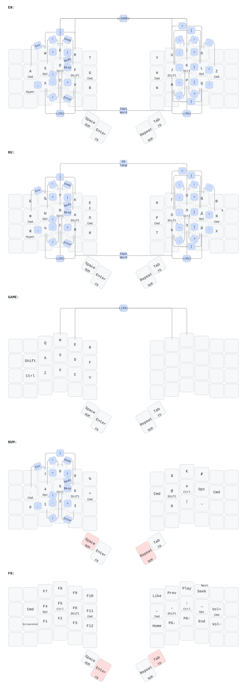

# sm_voyager_keymap
This is my personal keymap for ZSA Voyager

I've built in with such core principles:
- I need two separate layouts for latin and cyrillic symbols (they may differ from standart OS layouts)
- Symbols have to remain on same places no matter of current layout (or OS settings)
- Home-row mods have to work everywhere same manner no matter of current layout
- Every symbol must be reachable within 2 keys combo (eg. first key to move to layout, second is to tap)
- This layout is optimized comfortable working with mouse. Left hand stays on keyboard, right is on a mouse. So all base hotkeys are supposed to be pressed with left hand only. Numpad layer (and basic math operations) is also on left hand, so I'm able to walk thru and occasionally modify excel tables quickly.
- Combos for one-shot-mods (for both layouts)

## Layers


### Reading the diagram
- Big legend is a tap, small legend under it is a hold (`Cmd`, `Shift`, `NUM`, `FN`, ...). Home-row mods and layer keys are tap-dances handled by [sm_td](https://github.com/stasmarkin/sm_td), not plain `MT()`/`LT()`.
- Small legend in the upper right corner is what a **double tap** produces: `Я`/`Э`, `Ь`/`Ъ`, `.`/`:`, `Seek`/`Next`.
- Blue bubbles connected by lines are combos. The same physical keys give the same symbol on EN, RU and NUM, so muscle memory does not depend on the current layout.
- Highlighted thumb keys mark how the layer is reached: `NUM` is held on `Space`/`Repeat`, `FN` on `Enter`/`Tab`.

One family of combos is deliberately left off the picture, because as arcs over four adjacent keys they hide the layer underneath: **one-shot mods on the home row**. Press any subset of `A`/`S`/`D`/`F` (`Ф`/`Ы`/`В`/`А` on RU) together and hold to get the matching modifier combination — `A`+`S` is Cmd+Opt, `A`+`D` is Cmd+Ctrl, `S`+`D`+`F` is Opt+Ctrl+Shift, all four at once is Hyper. Release quickly instead of holding and it becomes a one-shot: the modifiers stay armed for the next keypress.

### Layers
- **EN** / **RU** — the two base layouts. `L(EN)` and `L(RU)` combos switch them together with the OS layout.
- **GAME** — plain QWERTY block with physical `Shift`/`Ctrl` on the left pinky: no home-row mods, no tap dances, nothing that reacts to how long you hold a key. The same four-key combo toggles it on and off.
- **NUM** — numpad and math on the left hand, currency and programming symbols on the right.
- **FN** — F-keys and screenshot on the left, arrows, navigation, volume and Spotify controls on the right.

There is one more layer in the firmware, `L_RU_FAKE`, which is not drawn here: it is a lookup table that maps cyrillic keycodes to their physical positions for [sm_layouts](https://github.com/stasmarkin/sm_layouts) and is never typed on.

## Building
The keymap itself lives in `sm/` and is built inside a QMK checkout (it needs the `stasmarkin/sm_td`, `stasmarkin/sm_layouts` and ZSA community modules declared in `sm/keymap.json`):

```bash
qmk compile -kb zsa/voyager -km sm
```

To regenerate the picture after editing `keymap.yaml`:

```bash
./update_keymap_image.sh
```
