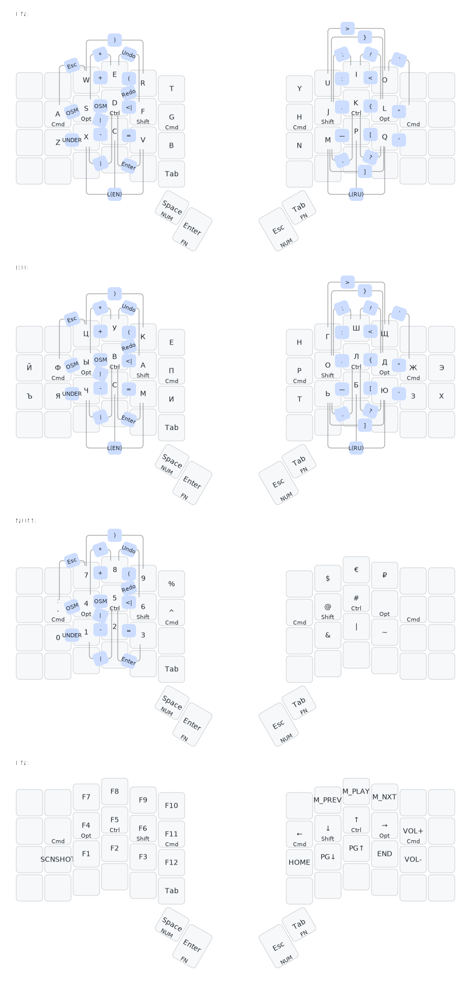

# sm_voyager_keymap
This is my personal keymap for ZSA Voyager

I've built in with such core principles:
- I need two separate layouts for latin and cyrillic symbols (they may differ from standart OS layouts)
- Symbols have to remain on same places no matter of current layout (or OS settings)
- Home-row mods have to work everywhere same manner no matter of current layout
- Every symbol must be reachable within 2 keys combo (eg. first key to move to layout, second is to tap)
- This layout is optimized comfortable working with mouse. Left hand stays on keyboard, right is on a mouse. So all base hotkeys are supposed to be pressed with left hand only. Numpad layer (and basic math operations) is also on left hand, so I'm able to walk thru and occasionally modify excel tables quickly.
- Combos for one-shot-mods (for both layouts)

## Layers 

